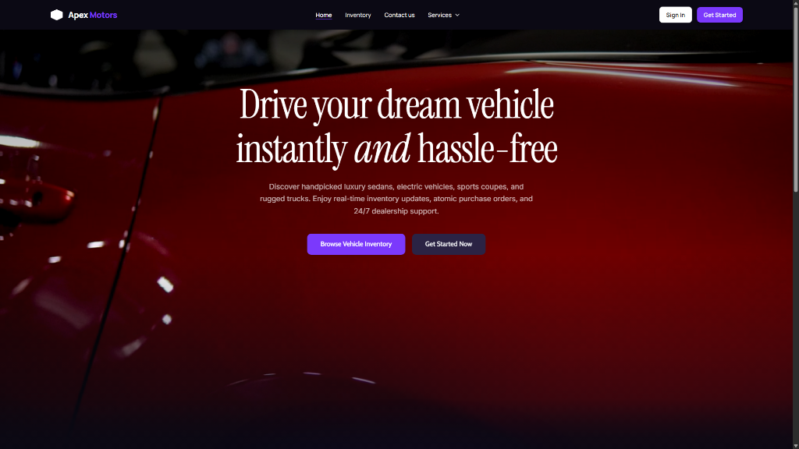
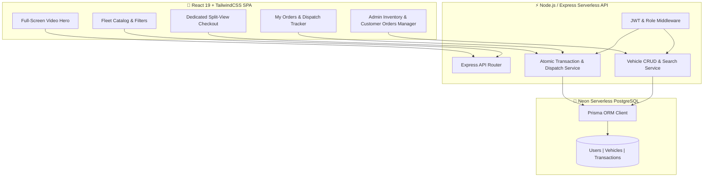

# 🏎️ ApexMotors — Enterprise Car Dealership Inventory System

<p align="center">
  <a href="https://apex-motorz.vercel.app/" target="_blank">
    
  </a>
  <a href="https://github.com/milantarsariya1/Car-Dealership-Inventory-System" target="_blank">
    
  </a>
</p>

<p align="center">
  
  
  
  
  
</p>

An enterprise-grade, full-stack **Car Dealership Inventory Management & Customer Order Dispatch System** built with **Node.js, Express, TypeScript, Prisma (Neon Cloud PostgreSQL)**, and **React + TailwindCSS**. Architected following strict **Test-Driven Development (TDD)** using the **Red-Green-Refactor** pattern and **SOLID software design principles**.

---

> [!IMPORTANT]
> ### 🚀 **Launch Live Application**
> 
> Production web application hosted on Vercel's global edge network:
> 
> <p align="center">
>   <a href="https://apex-motorz.vercel.app/" target="_blank">
>     
>   </a>
> </p>
> 
> - 🌐 **Production Deployment**: [https://apex-motorz.vercel.app/](https://apex-motorz.vercel.app/)
> - ⚡ **Serverless Cloud DB**: Neon Serverless PostgreSQL (US-East)
> - 🔑 **Instant Demo Logins**: 1-click preset login buttons inside the Sign In modal for both **Admin** (`admin@dealership.com`) and **Customer** (`customer@gmail.com`).

---

## 📸 Application Screenshots

<p align="center">
  
</p>

---

## 🏗️ System Architecture & Workflow



---

## ✨ Key Features & Capabilities

> [!NOTE]
> Designed to meet and exceed all core and advanced requirements of the TDD Kata specification.

### 🚗 Backend RESTful API
- **Token-Based Authentication**: Secure JWT bearer tokens with Role-Based Access Control (`ADMIN` vs `USER`).
- **Vehicle Inventory CRUD**: Comprehensive vehicle specifications (`VIN`, `make`, `model`, `category`, `price`, `quantity`, `imageUrl`, `description`).
- **Multi-Parameter Search**: Search & filter by make, model, VIN, category (`SEDAN`, `SUV`, `TRUCK`, `COUPE`, `EV`, `HYBRID`), and price range.
- **Atomic Stock & Order Processing**:
  - `POST /api/vehicles/:id/purchase`: Decrements stock quantity safely using database transactions. Rejects when stock is zero.
  - `POST /api/vehicles/:id/restock`: Atomically increases stock quantity (`ADMIN` restricted).
- **Customer Dispatch Tracker Engine**: Computes real-time 4-step dispatch status (`Order Confirmed` ➔ `Processing` ➔ `Dispatched` ➔ `Out for Delivery`) and estimated delivery dates based on order timestamps.
- **Cloud Database Integration**: Connected to Neon Cloud Serverless PostgreSQL via Prisma ORM 6.

### 🎨 Modern Single-Page Application (React SPA)
- **Luxury Automotive Aesthetics**: Dark mode theme (`#0b0914`), glassmorphism cards, continuous HTML5 video hero banner, and ambient radial glow accents.
- **Dedicated Split-View Checkout Page**: Left side showcases large vehicle hero image & specs; right side handles payment options and customer delivery address.
- **My Purchases & Order Tracker (`MyOrdersPage.tsx`)**: Displays all cars purchased by a customer with financial breakdown, delivery address on file, and visual 4-step dispatch progress bar.
- **Admin Command Center (`AdminOrdersTable.tsx`)**:
  - **Dealer Seller Role**: Admin is recognized as the dealership manager/seller. Purchase buttons are hidden for Admin and replaced with `🛡️ Dealer Seller` badges.
  - **Customer Orders & Pending Dispatches Manager**: Displays all customer purchases across the entire system, complete with purchaser contacts, shipping address, revenue totals, and dispatch tracking.
- **Ultra-Responsive**: Fully optimized for mobile smartphones (320px–480px), tablets, laptops, and ultra-wide displays with 0 horizontal overflow.

---

## 📋 API Endpoints Reference

| Method | Endpoint | Access | Description |
| :--- | :--- | :--- | :--- |
| `POST` | `/api/auth/register` | 🌐 Public | Register new account (`USER` or `ADMIN`) |
| `POST` | `/api/auth/login` | 🌐 Public | Authenticate credentials & return JWT token |
| `PUT` | `/api/auth/profile` | 🔑 User | Update personal profile & delivery shipping address |
| `GET` | `/api/vehicles` | 🌐 Public | Fetch complete vehicle inventory |
| `GET` | `/api/vehicles/search` | 🌐 Public | Search & filter vehicles by make, model, VIN, or category |
| `GET` | `/api/vehicles/:id` | 🌐 Public | Retrieve single vehicle specifications |
| `POST` | `/api/vehicles` | 🔒 Admin | Create a new vehicle entry |
| `PUT` | `/api/vehicles/:id` | 🔒 Admin | Update vehicle specifications |
| `DELETE` | `/api/vehicles/:id` | 🔒 Admin | Remove vehicle from dealership inventory |
| `POST` | `/api/vehicles/:id/purchase` | 🔑 User | Purchase vehicle (Atomically decrements stock) |
| `POST` | `/api/vehicles/:id/restock` | 🔒 Admin | Restock vehicle (Atomically increments stock) |
| `GET` | `/api/vehicles/my-orders/list` | 🔑 User | Fetch logged-in customer's orders & dispatch status |
| `GET` | `/api/vehicles/admin/orders` | 🔒 Admin | Fetch all customer purchase orders & shipping addresses |

---

## 🔑 Preset Demo Accounts

> [!TIP]
> Use these pre-seeded accounts or the 1-click login buttons inside the Sign In modal for fast verification.

| Role | Email | Password | Primary Capabilities |
| :--- | :--- | :--- | :--- |
| **Admin** | `admin@dealership.com` | `admin123` | Add/Edit/Delete/Restock Vehicles, View All Customer Orders & Dispatches, Manage User Database |
| **Customer** | `customer@gmail.com` | `user123` | Browse Fleet, Filter & Search, Checkout & Purchase Vehicles, Track Personal Order Dispatches |

---

## ⚡ Quick Start (Local Setup)

### Prerequisites
- **Node.js**: `v18.x` or higher
- **npm**: `v9.x` or higher

```bash
# 1. Clone Repository
git clone https://github.com/milantarsariya1/Car-Dealership-Inventory-System.git
cd Car-Dealership-Inventory-System

# 2. Backend Setup
cd backend
npm install
npx prisma db push
npm run seed
npm test
npm run dev

# 3. Frontend Setup (In a separate terminal window)
cd ../frontend
npm install
npm run dev
```

- 🌐 **Frontend App**: `http://localhost:5173`
- ⚡ **Backend API**: `http://localhost:5000`

---

## 🧪 Test Execution Report (TDD Suite)

> [!IMPORTANT]
> All unit and integration test suites passed cleanly with **100% success rate**.

```text
PASS tests/inventory.test.ts
  Inventory Transactions - Purchase & Restock
    POST /api/vehicles/:id/purchase
      ✓ should deduct stock quantity when a user purchases a vehicle
      ✓ should prevent purchase when stock quantity reaches 0
    POST /api/vehicles/:id/restock (Admin Only)
      ✓ should increase vehicle stock quantity when ADMIN restocks
      ✓ should reject restock request from non-admin user (403 Forbidden)

PASS tests/vehicles.test.ts
  Vehicle Inventory Endpoints (/api/vehicles)
    POST /api/vehicles (Admin Only)
      ✓ should allow ADMIN to add a new vehicle
      ✓ should reject vehicle creation from non-admin user (403 Forbidden)
    GET /api/vehicles & /api/vehicles/search
      ✓ should return list of vehicles
      ✓ should filter vehicles by search query and category
    PUT /api/vehicles/:id & DELETE /api/vehicles/:id
      ✓ should allow ADMIN to update vehicle price and quantity
      ✓ should allow ADMIN to delete a vehicle

PASS tests/auth.test.ts
  Auth Endpoints (/api/auth)
    POST /api/auth/register
      ✓ should register a new user successfully and return user details (excluding password)
      ✓ should reject registration if email is already registered
      ✓ should reject registration if required fields are missing
    POST /api/auth/login
      ✓ should authenticate user with valid credentials and return JWT token
      ✓ should reject login with incorrect password

Test Suites: 3 passed, 3 total
Tests:       15 passed, 15 total
Snapshots:   0 total
Time:        15.42 s
```

---

## 🤖 My AI Usage & Transparency Policy

### AI Tools Utilized
- **Google DeepMind Antigravity AI**: Used as an AI pair programmer for architecture planning, TDD test generation, Prisma schema migration, and React glassmorphism component design.

### How AI Was Used Throughout Development
1. **Red-Green-Refactor TDD**: AI generated failing Jest/Supertest assertion suites (**Red Phase**), followed by clean service implementations (**Green Phase**).
2. **Git Co-authorship Compliance**: All AI-assisted commits were tagged with official co-authorship trailers:
   ```text
   Co-authored-by: Antigravity AI <AI@users.noreply.github.com>
   ```
3. **Session Transparency**: Complete chronological prompt history logs are archived in [`PROMPTS.md`](./PROMPTS.md).

### AI Reflection & Impact
AI accelerated the development lifecycle by providing fast feedback during the TDD cycle, generating robust TypeScript interfaces, and crafting responsive UI layouts while maintaining strict code ownership and manual verification at every step.

---

<p align="center">
  Crafted with ❤️ by <b>Milan Tarsariya</b> using <b>Antigravity AI</b> · Deployed on <b>Vercel</b>
</p>
