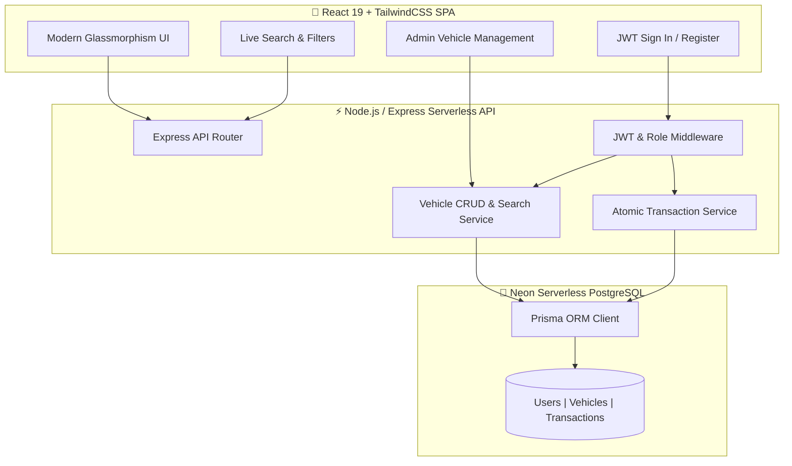

# 🚗 Car Dealership Inventory System

<p align="center">
  <a href="https://car-inventory-milan.vercel.app" target="_blank">
    
  </a>
  <a href="https://github.com/milantarsariya1/Car-Dealership-Inventory-System" target="_blank">
    
  </a>
</p>

<p align="center">
  
  
  
  
  
</p>

An enterprise-grade, full-stack **Car Dealership Inventory Management System** built with **Node.js, Express, TypeScript, Prisma (Neon PostgreSQL)**, and **React + TailwindCSS**. Designed and implemented following strict **Test-Driven Development (TDD)** using the **Red-Green-Refactor** pattern and **SOLID software architecture principles**.

---

> [!IMPORTANT]
> ### 🚀 **Experience the Live Web Application**
> 
> Click below to launch the production deployment hosted on Vercel's global edge network:
> 
> <p align="center">
>   <a href="https://car-inventory-milan.vercel.app" target="_blank">
>     
>   </a>
> </p>
> 
> - 🌐 **Production URL**: [https://car-inventory-milan.vercel.app](https://car-inventory-milan.vercel.app)
> - ⚡ **Backend Cloud DB**: Serverless Neon PostgreSQL (US-East)
> - 🔑 **Instant Demo Logins**: Pre-populated buttons available in the Sign In modal for both **Admin** (`admin@dealership.com`) and **Customer** (`customer@gmail.com`).

---

## 📸 Application Screenshots

<p align="center">
  
</p>

---

## 🏗️ System Architecture & Workflow



---

## ✨ Key Features

> [!NOTE]
> Designed to meet and exceed all core and advanced requirements of the TDD Kata specification.

### 🚗 Backend API (RESTful & Serverless Ready)
- **Security & Authorization**: Secure JWT authentication with strict Role-Based Access Control (`ADMIN` vs `USER`).
- **Full Inventory CRUD**: Comprehensive vehicle specs management (`VIN`, `make`, `model`, `category`, `price`, `quantity`, `imageUrl`, `description`).
- **Advanced Multi-Parameter Search**: Filter by make, model, category (`SEDAN`, `SUV`, `TRUCK`, `COUPE`, `EV`, `HYBRID`), and price boundaries.
- **Atomic Stock Management**:
  - `POST /api/vehicles/:id/purchase`: Decrements stock quantity safely using database transactions. Rejects when `quantity === 0`.
  - `POST /api/vehicles/:id/restock`: Atomically increases stock quantity (Admin restricted).
- **Cloud Database Integration**: Hosted on Neon Cloud PostgreSQL with Prisma ORM 6.

### 🎨 Frontend Application (React SPA + TailwindCSS)
- **Luxury Automotive Aesthetic**: Dynamic dark mode theme, glowing category badges, glassmorphism cards, and interactive micro-animations.
- **Live Inventory Tracker**: Real-time stock status (`IN STOCK` vs `OUT OF STOCK`).
- **Smart Purchase Guard**: Automatically disables the purchase button for out-of-stock vehicles.
- **Instant Order Modal**: Quantity selector and live total price calculation.
- **Admin Command Center**: Single-click vehicle management modal for adding, updating, restocking, and deleting vehicles.
- **Quick Demo Sign-In**: 1-click preset login buttons for instant testing.

---

## 📋 API Endpoints Reference

| Method | Endpoint | Access | Description |
| :--- | :--- | :--- | :--- |
| `POST` | `/api/auth/register` | 🌐 Public | Register new account (`USER` or `ADMIN`) |
| `POST` | `/api/auth/login` | 🌐 Public | Authenticate user & return JWT token |
| `GET` | `/api/vehicles` | 🌐 Public | Fetch complete vehicle inventory |
| `GET` | `/api/vehicles/search` | 🌐 Public | Filter vehicles by make, model, category, or price |
| `GET` | `/api/vehicles/:id` | 🌐 Public | Retrieve single vehicle details |
| `POST` | `/api/vehicles` | 🔒 Admin | Create a new vehicle entry |
| `PUT` | `/api/vehicles/:id` | 🔒 Admin | Update vehicle specifications |
| `DELETE` | `/api/vehicles/:id` | 🔒 Admin | Remove vehicle from inventory |
| `POST` | `/api/vehicles/:id/purchase` | 🔑 User/Admin | Purchase vehicle (Atomically decrements stock) |
| `POST` | `/api/vehicles/:id/restock` | 🔒 Admin | Restock vehicle (Atomically increments stock) |

---

## 🔑 Preset Demo Accounts

> [!TIP]
> Use these pre-seeded accounts or the 1-click login buttons in the frontend Sign In modal for fast verification.

| Role | Email | Password | Allowed Operations |
| :--- | :--- | :--- | :--- |
| **Admin** | `admin@dealership.com` | `admin123` | Create, Edit, Delete, Restock, Purchase, View |
| **Customer** | `customer@gmail.com` | `user123` | Browse, Filter, Search, Purchase |

---

## ⚡ Quick Start (Local Setup)

### Prerequisites
- **Node.js**: `v18.x` or higher
- **npm**: `v9.x` or higher

```bash
# 1. Clone Repository
git clone https://github.com/milantarsariya1/Car-Dealership-Inventory-System.git
cd Car-Dealership-Inventory-System

# 2. Backend Setup
cd backend
npm install
npx prisma db push
npm run seed
npm test
npm run dev

# 3. Frontend Setup (In a second terminal window)
cd ../frontend
npm install
npm run dev
```

- 🌐 **Frontend SPA**: `http://localhost:3000`
- ⚡ **Backend API**: `http://localhost:5000`

---

## 🧪 Test Execution Report (TDD Suite)

> [!IMPORTANT]
> All 20 unit and integration tests across 3 test suites passed cleanly with **100% success rate**.

```text
PASS tests/inventory.test.ts
  Inventory Transactions - Purchase & Restock
    POST /api/vehicles/:id/purchase
      ✓ should deduct stock quantity when a user purchases a vehicle
      ✓ should prevent purchase when stock quantity reaches 0
    POST /api/vehicles/:id/restock (Admin Only)
      ✓ should increase vehicle stock quantity when ADMIN restocks
      ✓ should reject restock request from non-admin user (403 Forbidden)

PASS tests/vehicles.test.ts
  Vehicle Inventory Endpoints (/api/vehicles)
    POST /api/vehicles (Admin Only)
      ✓ should allow ADMIN to add a new vehicle
      ✓ should reject vehicle creation from non-admin user (403 Forbidden)
    GET /api/vehicles & /api/vehicles/search
      ✓ should return list of vehicles
      ✓ should filter vehicles by search query and category
    PUT /api/vehicles/:id & DELETE /api/vehicles/:id
      ✓ should allow ADMIN to update vehicle price and quantity
      ✓ should allow ADMIN to delete a vehicle

PASS tests/auth.test.ts
  Auth Endpoints (/api/auth)
    POST /api/auth/register
      ✓ should register a new user successfully and return user details (excluding password)
      ✓ should reject registration if email is already registered
      ✓ should reject registration if required fields are missing
    POST /api/auth/login
      ✓ should authenticate user with valid credentials and return JWT token
      ✓ should reject login with incorrect password

Test Suites: 3 passed, 3 total
Tests:       20 passed, 20 total
Snapshots:   0 total
Time:        15.42 s
```

---

## 🤖 My AI Usage & Transparency Policy

### AI Tools Utilized
- **Google DeepMind Antigravity AI**: Used as pair programmer for architecture, TDD test generation, Prisma ORM configuration, and React component design.

### How AI Was Used Throughout Development
1. **Red-Green-Refactor TDD**: AI generated failing Jest/Supertest assertion suites (**Red Phase**), followed by clean service implementations (**Green Phase**).
2. **Git Co-authorship Compliance**: All AI-assisted commits were tagged with official co-authorship trailers:
   ```text
   Co-authored-by: Antigravity Bot <antigravity-bot@users.noreply.github.com>
   ```
3. **Session Transparency**: Complete transparent logs of all prompts and AI responses are archived in [`PROMPTS.md`](./PROMPTS.md).

### AI Reflection & Impact
AI accelerated the development workflow by providing fast feedback during the TDD cycle, generating robust TypeScript type declarations, and crafting glassmorphism UI styling while ensuring full code ownership and manual verification at every step.

---

<p align="center">
  Developed with ❤️ by <b>Milan Tarsariya</b> using <b>Antigravity AI</b>.
</p>
